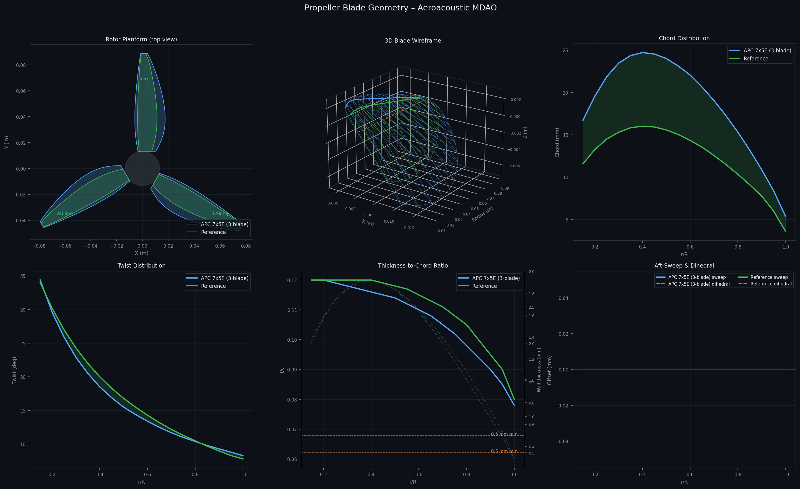

# Aeroacoustic Propeller MDAO

Multidisciplinary design optimization of a UAV propeller for minimum noise subject to real-world drone performance and structural constraints.

**Baseline:** HQProp 7x4x3 (7-inch, 3-blade, NACA 4412)

---

## Geometry Comparison

| Baseline vs Optimised (Phase 2) | APC 7x5E vs HQProp 7x4x3 |
|---|---|
|  |  |

---

## Drone Sizing Basis

The optimization targets a real 7-inch long-range UAV with the following all-up weight breakdown:

| Component | Mass |
|-----------|------|
| Frame (ImpulseRC Apex 7 carbon) | 120 g |
| Motors x4 (2306 1750KV) | 168 g |
| ESC 4-in-1 45A | 30 g |
| Flight controller | 20 g |
| Battery (4S 3300 mAh LiPo) | 235 g |
| Props x4 | 48 g |
| FPV camera / DJI O3 Air Unit | 55 g |
| GPS + receiver + wiring | 48 g |
| **Total AUW** | **724 g → W = 7.10 N** |

**Per-prop thrust targets** (motor bench data: T-Motor F40 Pro IV, 7x4 prop, 4S):

| Operating point | RPM | Thrust/prop |
|-----------------|-----|-------------|
| Hover (40% throttle) | ~5,800 | 1.78 N |
| Maneuver TWR 2.5 (80%) | ~9,200 | **4.44 N** ← constraint |
| Full throttle | ~10,400 | 6.20 N |

---

## Phase 2 Optimization Results

**Objective:** minimize `0.7·SPL_hover + 0.3·SPL_cruise`
**Optimizer:** Hybrid GA (pop=50, gen=30) → SLSQP warm-start

| Metric | Baseline | Optimised | Notes |
|--------|----------|-----------|-------|
| RPM | 6,000 | 9,221 | driven up by TWR 2.5 constraint |
| Thrust/prop (hover) | 1.62 N | **4.37 N** | +170%, meets maneuver target |
| Thrust/prop (cruise) | −0.66 N | **1.64 N** | becomes positive |
| SPL hover | 31.15 dBA | 42.22 dBA | +11 dB — RPM penalty |
| SPL weighted | 31.38 dBA | **39.83 dBA** | best achievable at TWR 2.5 |
| Max root stress | 8.97 MPa | **21.61 MPa** | at 22 MPa SLA limit |
| Min wall thickness | 0.28 mm | **0.50 mm** | at 0.5 mm print limit |
| Blade spacing | 0/120/240° | **0/106/254°** | asymmetric for BPF reduction |

**Key design changes made by the optimizer:**
- **Inboard twist down (−3–5°), outboard up (+5°):** shifts lift outboard where it is more efficient at high RPM
- **Sections thickened (+0.04 t/c everywhere):** only feasible way to meet the 0.5 mm wall and 22 MPa stress constraint at 9,221 RPM
- **Chord narrowed (−0.03R):** thicker t/c compensates thrust; narrower blade reduces BPM broadband noise
- **Unequal blade spacing (0/106/254°):** breaks BPF coherence to reduce tonal interference

**Physical trade-off:** TWR 2.5 requires ~9,200 RPM. Tip speed rises from 17.7 → 27.2 m/s (+54%). BPM broadband noise scales roughly as tip-speed⁵ — the acoustic penalty is unavoidable. The optimizer found the quietest geometry *within* the maneuvering constraint.

---

## Phase 1 Results (for reference)

Phase 1 used a simpler acoustic model (TBL-TE only, no LBL-VS) and 1 N hover thrust constraint.

| Metric | Baseline | Phase 1 Opt | Change |
|--------|----------|-------------|--------|
| SPL total (dBA) | 28.73 | 21.22 | −7.5 dBA |
| Thrust (N) | 1.12 | 1.00 | −0.12 N |
| RPM | 5,000 | 5,000 | — |

---

## Project Stack

```
quiet-prop/
  geometry/
    blade_generator.py      HQProp 7x4x3 parametric blade (18-station, full 3D)
    blade_importer.py       Catalogue importer: APC 7x4E/5E/6E, GWS 7x3.5, HQProp
    blade_stl_exporter.py   Pure-Python STL triangulator (drone frame: XY disk, +Z thrust)

  aerodynamics/
    ccblade_component.py    BEM solver + Michel boundary-layer transition criterion

  acoustics/
    bpm_component.py        BPM TBL-TE broadband + LBL-VS + Gutin tonal + unequal-spacing

  structures/
    structural_component.py Centrifugal + bending root stress; SLA resin 22 MPa limit

  optimization/
    mdao_problem.py         OpenMDAO MDAO — 85 DVs, hybrid GA+SLSQP, multipoint

  results/
    plots/
      geometry_viz.py             6-panel geometry visualizer
      optimised_vs_baseline.png   Phase 2 optimised vs HQProp baseline
      apc7x5e_vs_hqprop.png       APC 7x5E vs HQProp comparison
      blade_geometry.png          Phase 1 baseline vs optimised
      blade_geometry_unequal.png  Equal vs unequal blade spacing
    stl/
      rotor_baseline.stl          HQProp 7x4x3 baseline rotor
      rotor_optimised.stl         Phase 2 optimised rotor
      rotor_APC_7x5E_2blade.stl   APC 7x5E (2-blade)
      rotor_APC_7x5E_3blade.stl   APC 7x5E (3-blade config)
      rotor_APC_7x4E_2blade.stl   APC 7x4E
      rotor_APC_7x6E_2blade.stl   APC 7x6E
      rotor_GWS_7x3.5_2blade.stl  GWS 7x3.5
      blade_baseline_single.stl   Single baseline blade (slicer inspection)
      blade_APC_7x5E_single.stl   Single APC 7x5E blade

  tests/
    test_baseline.py        Validation suite (4/4 pass)
```

---

## Physics Models

### Aerodynamics — Blade Element Momentum
- Two-regime BEM: static hover (V=0) and forward flight
- Prandtl tip and hub loss correction
- NACA 4412 lift/drag polar
- **Michel's boundary-layer transition criterion:**
  `Re_x_tr = 3.2e5 · exp(−0.06·|α|)` → `x_tr_c` per station

### Acoustics — Brooks-Pope-Marcolini (1989)
- **TBL-TE broadband:** Schlichting turbulent boundary layer displacement thickness; weighted by `(1 − x_tr_c)`
- **LBL-VS:** laminar vortex shedding; triggered when `x_tr_c > 0.3` (dominant at Re ~ 1×10⁵); weighted by `x_tr_c`. 10–20 dB louder than TBL-TE — forces optimizer to trip transition
- **Gutin tonal:** Garrick-Watkins with Bessel function `J_{mB}(x)` correction
- **Unequal blade spacing:** Fourier interference factor `|Σ exp(j·m·B·θ_k)| / B` per harmonic

### Structures — SLA Resin Blade
| Parameter | Value |
|-----------|-------|
| Density | 1200 kg/m³ |
| Tensile yield | 55 MPa |
| Safety factor | 2.5 |
| **Allowable stress** | **22 MPa** |
| Min print wall | 0.5 mm |

Stress model: centrifugal (integral `ρω²∫r·A(r)dr`) + bending (`M_b/Z_root`).  
Baseline tip wall = 0.28 mm → violates constraint → optimizer must increase t/c.

---

## Design Variables (85 total)

| Variable | Count | Bounds | Description |
|----------|-------|--------|-------------|
| `rpm` | 1 | [3500, 10000] | Rotational speed |
| `delta_twist_deg` | 18 | [−5, +5] | Twist perturbation per station |
| `delta_chord_R` | 18 | [−0.03, +0.03] | Chord/R perturbation |
| `sweep_R` | 18 | [0, 0.12] | Aft-sweep offset/R |
| `delta_tc` | 18 | [−0.03, +0.04] | t/c perturbation |
| `z_offset_R_tip` | 10 | [−0.05, +0.10] | Dihedral (outer 55–100% span) |
| `theta2` | 1 | [105, 135] | Azimuthal position of blade 2 (deg) |
| `theta3` | 1 | [225, 255] | Azimuthal position of blade 3 (deg) |

---

## Constraints

| Constraint | Bound | Physics |
|------------|-------|---------|
| `thrust_hover` | ≥ 4.44 N | TWR 2.5 for 724 g drone (4 rotors) |
| `thrust_cruise` | ≥ 2.00 N | Level flight at 15 m/s |
| `max_stress` | ≤ 22 MPa | SLA resin allowable (55 MPa / SF 2.5) |
| `min_thickness` | ≥ 0.50 mm | SLA printer minimum wall |
| `imbalance_factor` | ≤ 0.15 | Rotor balance `\|Σ exp(jθ_k)\|/B` |

---

## Propeller Catalogue

`geometry/blade_importer.py` provides hardcoded geometry for common 7" props (source: Brandt & Selig 2011, UIUC database; Selig & Guglielmo 1997):

```python
from geometry.blade_importer import load_prop, list_catalog

print(list_catalog())
# ['APC_7x4E', 'APC_7x5E', 'APC_7x6E', 'GWS_7x3.5', 'HQProp_7x4x3']

blade = load_prop("APC_7x5E")                        # 2-blade
blade = load_prop("APC_7x5E", num_blades_override=3) # 3-blade config
blade = load_prop("APC_7x5E", allow_fetch=True)      # try UIUC first
```

---

## STL Export

All STL files use the drone coordinate system: **XY = rotor disk plane, +Z = thrust axis**.

```python
from geometry.blade_stl_exporter import export_rotor_stl, export_blade_stl
from geometry.blade_importer import load_prop

blade = load_prop("APC_7x5E", num_blades_override=3)
export_rotor_stl(blade, "rotor.stl", add_hub=True)
export_blade_stl(blade, "blade.stl")
```

Open any `.stl` in Meshmixer, PrusaSlicer, or Windows 3D Viewer.

---

## Quick Start

```bash
pip install openmdao scipy numpy matplotlib pyDOE3

cd quiet-prop

# Validate the baseline stack
python tests/test_baseline.py

# Run Phase 2 optimization (GA + SLSQP, ~10-20 min)
python optimization/mdao_problem.py

# Regenerate geometry plots
python results/plots/geometry_viz.py

# Export STL for all catalogue props
python geometry/blade_stl_exporter.py

# Browse the propeller catalogue
python geometry/blade_importer.py
```

---

## Optimization Roadmap

| Phase | Variables | Models | Status |
|-------|-----------|--------|--------|
| 1 | RPM, twist×18, chord×18 | BEM + BPM TBL-TE | Done — −7.5 dBA at 1 N constraint |
| **2** | **+sweep, t/c, dihedral, blade angles** | **+LBL-VS, structural, multipoint** | **Done — TWR 2.5, 724 g drone** |
| 3 | Airfoil shape (PARSEC/CST) | BEM + BPM + higher-fidelity BL | Planned |
| 4 | All + CFD surrogates | RANS-informed BPM | Planned |
