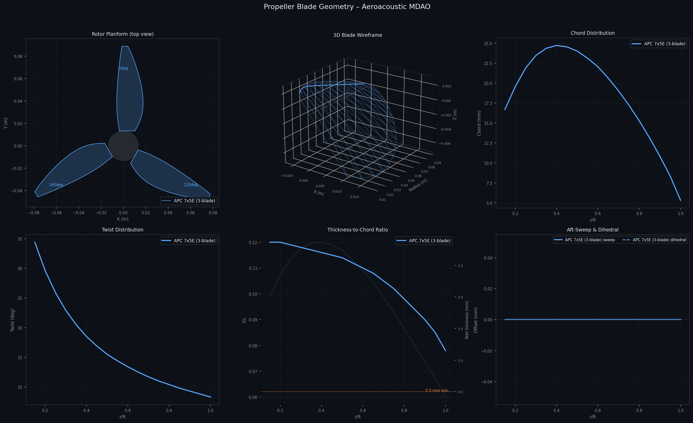
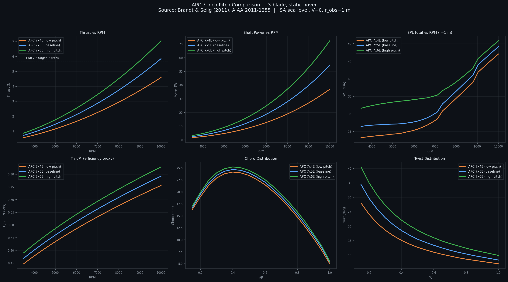
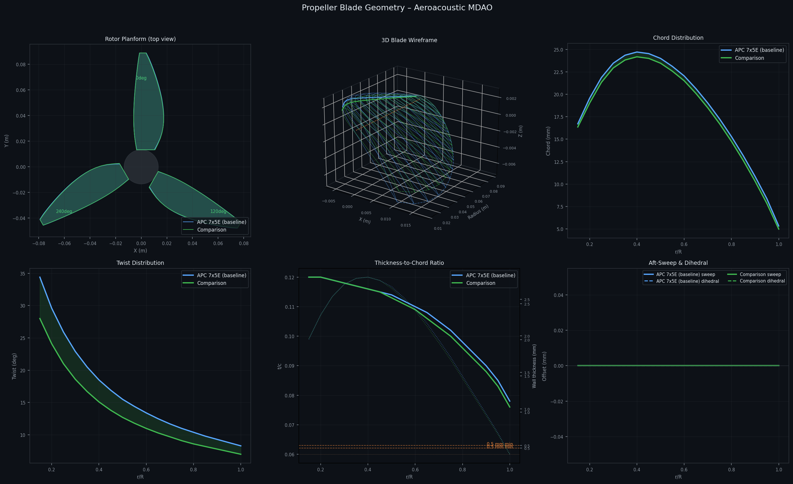
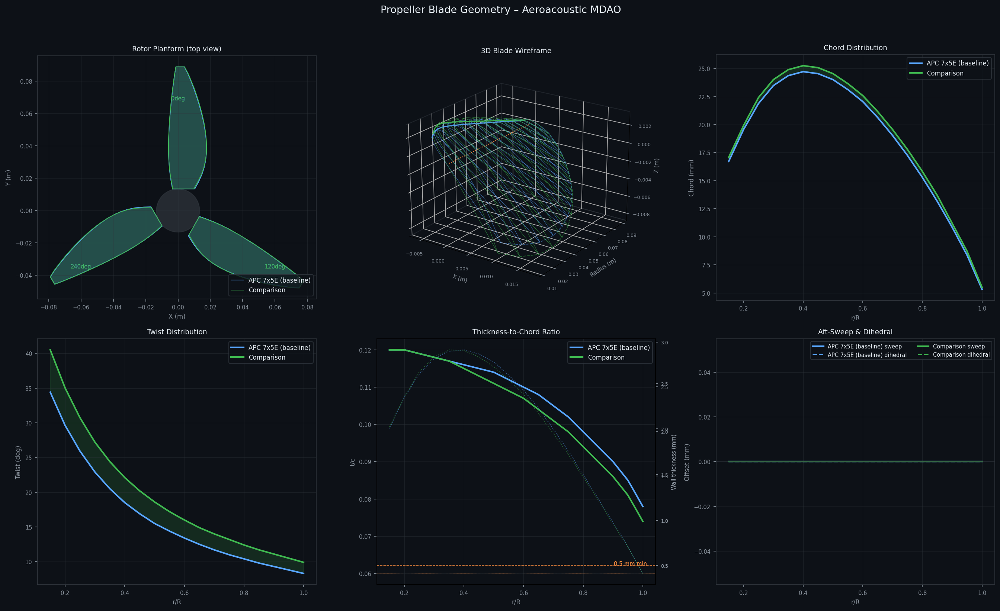
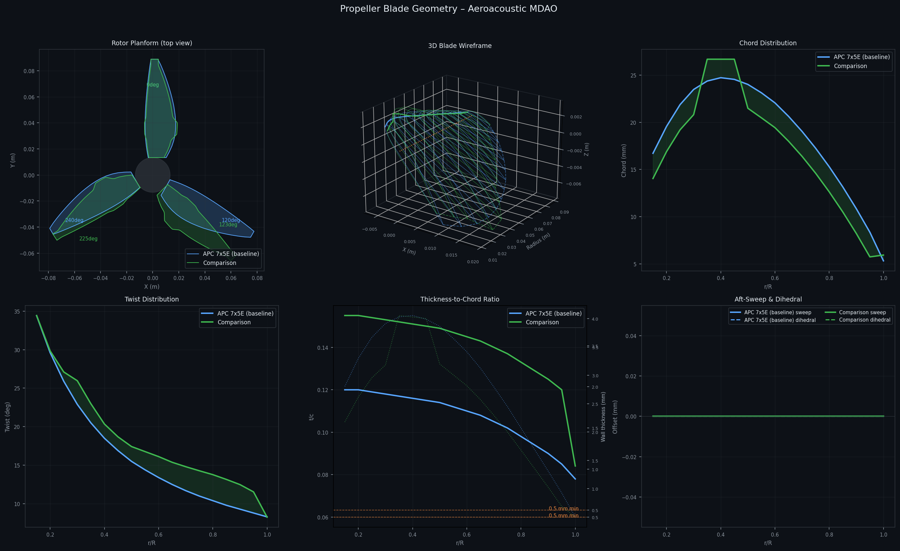

# Aeroacoustic Propeller MDAO

Multidisciplinary design optimization of a UAV propeller for minimum noise subject to real-world drone performance and structural constraints.

**Baseline:** APC 7x5E (7-inch, 3-blade, NACA 4412) — geometry from Brandt & Selig (2011), AIAA 2011-1255

---

## Geometry & Performance Comparisons

All reference geometries sourced from Brandt & Selig (2011), UIUC Propeller Database.

| APC 7x5E baseline | APC pitch variants (7x4E / 7x5E / 7x6E) |
|---|---|
|  |  |

| 7x5E vs 7x4E (lower pitch) | 7x5E vs 7x6E (higher pitch) |
|---|---|
|  |  |

---

## Drone Sizing Basis

The optimization targets a real 7-inch long-range UAV with the following all-up weight breakdown:

| Component | Mass |
|-----------|------|
| Frame (ImpulseRC Apex 7 carbon) | 120 g |
| Motors x4 (iFlight XING-E 2814 900KV) | 272 g |
| ESC 4-in-1 45A | 30 g |
| Flight controller | 20 g |
| Battery (4S 3300 mAh LiPo) | 335 g |
| Props x4 | 48 g |
| FPV camera / DJI O3 Air Unit | 55 g |
| GPS + receiver + wiring | 48 g |
| **Total AUW** | **928 g → W = 9.10 N** |

**Motor rationale:** 900 KV × 14.8 V (4S nominal) = 13,320 RPM no-load; ~75% under prop load → ~10,000 RPM max. This places the full RPM operating envelope [3,500–10,000] squarely in the motor's efficient band.

**Per-prop thrust targets** (BEM-derived, APC 7x5E 3-blade on 4S):

| Operating point | RPM (est.) | Thrust/prop |
|-----------------|------------|-------------|
| Hover (1g) | ~7,000 | 2.28 N |
| Cruise, 15 m/s (pitch-corrected axial inflow 3.32 m/s) | ~7,000 | **2.33 N** ← constraint |
| Maneuver TWR 2.5 | ~9,500 | **5.69 N** ← constraint |
| Full throttle | ~10,000 | ~7.96 N |

---

## Phase 2 Optimization Results

**Objective:** minimize `0.7·SPL_hover + 0.3·SPL_cruise`
**Optimizer:** Hybrid GA (pop=50, gen=30) → SLSQP warm-start
**Baseline:** APC 7x5E 3-blade, 928 g AUW, TWR 2.5 constraint (5.69 N/rotor)

|  |
|:---:|
| *APC 7x5E baseline (blue) vs Phase 2 optimised (green)* |

| Metric | Baseline @ 7000 RPM | Optimised @ 9459 RPM | Notes |
|--------|---------------------|----------------------|-------|
| Thrust hover | 2.87 N | **5.66 N** | meets TWR 2.5 target |
| Thrust cruise | — | 1.56 N | stale result — cruise model corrected, re-running |
| Power hover | 17.19 W | 34.90 W | +103% |
| SPL hover | 30.96 dBA | **46.24 dBA** | +15 dB — RPM penalty |
| SPL weighted | 31.99 dBA | **43.21 dBA** | best found at TWR 2.5 |
| Max root stress | — | 14.28 MPa | ≤ 22 MPa ✓ |
| Min wall thickness | — | **0.50 mm** | at print limit ✓ |
| Imbalance | 0/120/240° | **0/123/225°** | unequal spacing ✓ |

**Key design changes:**
- **Twist up +1–3.4° outboard:** shifts lift outboard to generate thrust at high RPM
- **t/c +0.035 uniformly:** driven by 0.5 mm wall thickness constraint at 9,459 RPM
- **Chord narrowed inboard, neutral midspan:** reduces drag while holding thrust
- **Blade spacing 0/123/225°:** breaks BPF coherence for tonal noise reduction
- **Sweep and dihedral: zero** — optimizer found no acoustic benefit at this operating point

**Note:** The cruise model has been corrected since this run (see below). Results above are being superseded by a re-run with the physically correct cruise constraint.

---

## Project Stack

```
quiet-prop/
  geometry/
    blade_generator.py      APC 7x5E (3-blade) parametric baseline (18-station, full 3D)
    blade_importer.py       Catalogue: APC 7x4E/5E/6E, GWS 7x3.5 (Brandt & Selig 2011)
    blade_stl_exporter.py   Pure-Python STL triangulator (drone frame: XY disk, +Z thrust)

  aerodynamics/
    ccblade_component.py    BEM solver + Michel boundary-layer transition criterion

  acoustics/
    bpm_component.py        BPM TBL-TE broadband + LBL-VS + Gutin tonal + unequal-spacing

  structures/
    structural_component.py Centrifugal + bending root stress; SLA resin 22 MPa limit

  optimization/
    mdao_problem.py         OpenMDAO MDAO — 85 DVs, hybrid GA+SLSQP, multipoint

  results/
    plots/
      geometry_viz.py             6-panel geometry visualizer
      compare_apc_pitch.py        APC pitch-variant performance sweep (7x4E / 7x5E / 7x6E)
      blade_geometry.png          APC 7x5E baseline geometry (6 panels)
      apc_pitch_comparison.png    Thrust / Power / SPL / efficiency vs RPM, all 3 variants
      apc_7x5e_vs_7x4e.png        Geometry overlay: 7x5E vs 7x4E
      apc_7x5e_vs_7x6e.png        Geometry overlay: 7x5E vs 7x6E
      blade_geometry_unequal.png  Equal vs unequal blade spacing (Phase-2 preview)
    stl/
      rotor_APC_7x5E_3blade.stl   APC 7x5E baseline rotor (3-blade)
      rotor_APC_7x4E_3blade.stl   APC 7x4E pitch variant (3-blade)
      rotor_APC_7x6E_3blade.stl   APC 7x6E pitch variant (3-blade)
      rotor_baseline_unequal.stl  APC 7x5E with unequal blade spacing
      blade_baseline_single.stl   Single baseline blade (slicer inspection)

  tests/
    test_baseline.py        Validation suite (7 tests)
```

---

## Physics Models

### Cruise Operating Point — Pitched-Forward Quadrotor

The cruise constraint uses the physically correct axial inflow, not the full forward speed.
A quadrotor at 15 m/s pitches forward at equilibrium angle θ, so the rotor disk sees only the axial component of the freestream (Wagter et al. 2014; ICAS 2020-0781):

| Parameter | Value | Derivation |
|-----------|-------|------------|
| Forward speed | 15.0 m/s | — |
| Body drag area CdA | 0.015 m² | Cd ≈ 0.30, A ≈ 0.05 m² |
| Body drag force | 2.07 N | ½ρV²·CdA |
| Pitch angle θ | 12.8° | arctan(F_drag / W) |
| **BEM axial inflow** | **3.32 m/s** | V·sin(θ) |
| **Cruise thrust/rotor** | **2.33 N** | W/(4·cos θ) |

Using V=15 m/s as full axial inflow would overstate thrust loss by ~4.5× and make the constraint physically impossible for a fixed-pitch 7" prop.

### Aerodynamics — Blade Element Momentum
- Two-regime BEM: static hover (V=0) and forward flight
- Prandtl tip and hub loss correction
- NACA 4412 lift/drag polar
- **Michel's boundary-layer transition criterion:**
  `Re_x_tr = 3.2e5 · exp(−0.06·|α|)` → `x_tr_c` per station

### Acoustics — Brooks-Pope-Marcolini (1989)
- **TBL-TE broadband:** Schlichting turbulent boundary layer displacement thickness; weighted by `(1 − x_tr_c)`
- **LBL-VS:** laminar vortex shedding; triggered when `x_tr_c > 0.3` (dominant at Re ~ 1×10⁵); weighted by `x_tr_c`. 10–20 dB louder than TBL-TE — forces optimizer to trip transition
- **Gutin tonal:** Garrick-Watkins with Bessel function `J_{mB}(x)` correction
- **Unequal blade spacing:** Fourier interference factor `|Σ exp(j·m·B·θ_k)| / B` per harmonic

### Structures — SLA Resin Blade
| Parameter | Value |
|-----------|-------|
| Density | 1200 kg/m³ |
| Tensile yield | 55 MPa |
| Safety factor | 2.5 |
| **Allowable stress** | **22 MPa** |
| Min print wall | 0.5 mm |

Stress model: centrifugal (integral `ρω²∫r·A(r)dr`) + bending (`M_b/Z_root`).

---

## Design Variables (85 total)

| Variable | Count | Bounds | Description |
|----------|-------|--------|-------------|
| `rpm` | 1 | [3500, 10000] | Rotational speed |
| `delta_twist_deg` | 18 | [−5, +5] | Twist perturbation per station |
| `delta_chord_R` | 18 | [−0.03, +0.03] | Chord/R perturbation |
| `sweep_R` | 18 | [0, 0.12] | Aft-sweep offset/R |
| `delta_tc` | 18 | [−0.03, +0.04] | t/c perturbation |
| `z_offset_R_tip` | 10 | [−0.05, +0.10] | Dihedral (outer 55–100% span) |
| `theta2` | 1 | [105, 135] | Azimuthal position of blade 2 (deg) |
| `theta3` | 1 | [225, 255] | Azimuthal position of blade 3 (deg) |

---

## Constraints

| Constraint | Bound | Physics |
|------------|-------|---------|
| `thrust_hover` | ≥ 5.69 N | TWR 2.5 for 928 g drone (4 rotors) |
| `thrust_cruise` | ≥ 2.33 N | Cruise at 15 m/s — pitch-corrected axial inflow (3.32 m/s) |
| `max_stress` | ≤ 22 MPa | SLA resin allowable (55 MPa / SF 2.5) |
| `min_thickness` | ≥ 0.50 mm | SLA printer minimum wall |
| `imbalance_factor` | ≤ 0.15 | Rotor balance `\|Σ exp(jθ_k)\|/B` |

---

## Propeller Catalogue

`geometry/blade_importer.py` provides hardcoded geometry for common 7" props sourced from peer-reviewed measurements (Brandt & Selig 2011, AIAA 2011-1255; Selig & Guglielmo 1997):

```python
from geometry.blade_importer import load_prop, list_catalog

print(list_catalog())
# ['APC_7x4E', 'APC_7x5E', 'APC_7x6E', 'GWS_7x3.5']

blade = load_prop("APC_7x5E")                        # 2-blade (as measured)
blade = load_prop("APC_7x5E", num_blades_override=3) # 3-blade config
blade = load_prop("APC_7x5E", allow_fetch=True)      # try UIUC first
```

---

## STL Export

All STL files use the drone coordinate system: **XY = rotor disk plane, +Z = thrust axis**.

```python
from geometry.blade_stl_exporter import export_rotor_stl, export_blade_stl
from geometry.blade_importer import load_prop

blade = load_prop("APC_7x5E", num_blades_override=3)
export_rotor_stl(blade, "rotor.stl", add_hub=True)
export_blade_stl(blade, "blade.stl")
```

Open any `.stl` in Meshmixer, PrusaSlicer, or Windows 3D Viewer.

---

## Quick Start

```bash
pip install openmdao scipy numpy matplotlib pyDOE3

cd quiet-prop

# Validate the baseline stack
python tests/test_baseline.py

# Run Phase 2 optimization (GA + SLSQP, ~10-20 min)
python optimization/mdao_problem.py

# Regenerate geometry plots
python results/plots/geometry_viz.py

# Regenerate APC pitch comparison plots
python results/plots/compare_apc_pitch.py

# Export STL for all catalogue props
python geometry/blade_stl_exporter.py

# Browse the propeller catalogue
python geometry/blade_importer.py
```

---

## Optimization Roadmap

| Phase | Variables | Models | Status |
|-------|-----------|--------|--------|
| 1 | RPM, twist×18, chord×18 | BEM + BPM TBL-TE | Done (HQProp baseline — superseded) |
| **2** | **+sweep, t/c, dihedral, blade angles** | **+LBL-VS, structural, multipoint** | **In progress — APC 7x5E baseline, 928 g drone** |
| 3 | Airfoil shape (PARSEC/CST) | BEM + BPM + higher-fidelity BL | Planned |
| 4 | All + CFD surrogates | RANS-informed BPM | Planned |
