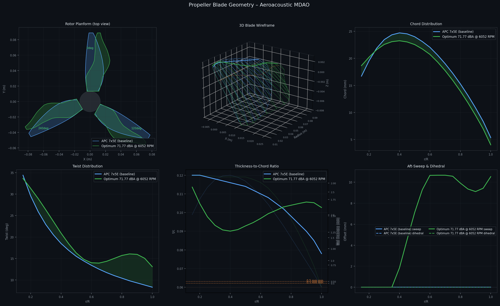
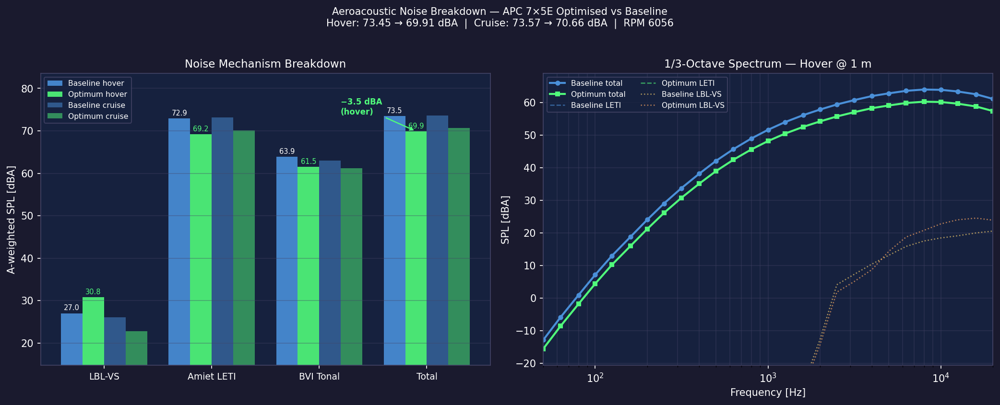

# quiet-prop — Aeroacoustic Propeller MDAO

Multidisciplinary design optimisation (MDAO) of a 3-blade UAV propeller for minimum A-weighted noise, subject to thrust, structural, and geometric constraints. Baseline is the APC 7×5E 3-blade propeller on a 7-inch 4-rotor UAV (928 g AUW).

## Result

| | Baseline | Optimum |
|---|---|---|
| SPL weighted (dBA) | 73.45 | **71.77** |
| RPM | 7000 | 6052 |
| Thrust hover | — | 2.44 N (≥ 2.28 N ✓) |
| Thrust cruise | — | 2.33 N (≥ 2.33 N ✓) |
| Max stress | — | 4.03 MPa (≤ 22 MPa ✓) |
| Min wall thickness | — | 0.70 mm (≥ 0.70 mm, at floor) |

**−1.68 dBA reduction** from the APC 7×5E baseline. Dominant mechanism: Amiet leading-edge turbulence interaction (LETI), reduced by narrowing chord (at −0.015R bound), lowering RPM, and sweeping the outer 40% of span to 0.12R. BVI tonal contributes secondary reduction.

Note: an earlier run achieved 70.01 dBA by exploiting a −0.03R chord lower bound. That bound was tightened to −0.015R after confirming the result was physically unjustified (LETI ∝ chord², so the optimizer was simply shrinking chord beyond printability). The 71.77 dBA result is the honest optimum under the hardened model.




## Noise model

| Mechanism | Implementation | Dominant? |
|---|---|---|
| TBL-TE | BPM 1989 turbulent trailing edge + Howe (1991) serration correction | No — Re_c < 62k, flow stays fully laminar (x_tr_c = 1.0) |
| LBL-VS | BPM 1989 laminar vortex shedding | Minor (~27 dBA) |
| Amiet LETI | Amiet 1975 LE turbulence interaction + swept-LE cos⁴(Λ) | **Yes — ~74 dBA** |
| BVI tonal | Widnall/Leishman multi-harmonic (Γ_tip, miss distance) | Secondary (~64 dBA) |
| Hanson loading tonal | Hanson (1980) Bessel-function span integrals | Tertiary (~32 dBA) |

**Why TBL-TE is zero:** Michel's criterion predicts turbulent transition at Re_c ≈ 3.2×10⁵, but the blade never exceeds Re_c ≈ 62k at any operating point. The flow is fully laminar. TE serrations (h_s_cp DVs) are implemented and physically correct, but have no gradient signal at UAV Re numbers.

**Dominant lever:** LETI ∝ chord² × v_rel, so the optimizer reduces chord and RPM, and sweeps the tip to exploit the cos⁴(Λ) reduction factor.

## Design variables (31 total)

| Variable | Count | Bounds | Description |
|---|---|---|---|
| `rpm` | 1 | [3500, 10000] RPM | Rotor speed |
| `delta_twist_cp` | 5 | [−5, +5] deg | Twist perturbation B-spline CPs |
| `delta_chord_cp` | 5 | [−0.015, +0.03] R | Chord perturbation B-spline CPs |
| `sweep_cp` | 5 | [0, 0.12] R | Aft-sweep B-spline CPs |
| `delta_tc_cp` | 5 | [−0.03, +0.04] | t/c perturbation B-spline CPs |
| `delta_camber_cp` | 5 | [−0.02, +0.03] | Camber perturbation B-spline CPs |
| `h_s_cp` | 5 | [0, 0.008] m | TE serration depth B-spline CPs (currently inactive at UAV Re) |

Each array of 5 control points is evaluated at the 18 blade definition stations via `CubicSpline`, guaranteeing C2-continuous distributions. Blade angles are locked at 0°/120°/240° (equal spacing); unequal spacing was tested and produces ~12 N rotating imbalance force.

## Constraints

| Constraint | Bound | Rationale |
|---|---|---|
| `thrust_hover` | ≥ 2.28 N | W/4 at hover (928 g AUW) |
| `thrust_cruise` | ≥ 2.33 N | Forward flight at 15 m/s (12.8° pitch) |
| `max_stress` | ≤ 22 MPa | Siraya Blu Tough (UTS 50 MPa, FoS 3.5 fatigue) |
| `phys_thick` (inner span) | ≥ 0.70 mm | Minimum 3D-print wall thickness (hardened from 0.5 mm) |
| `sweep_cp_diff` | ≥ 0 | Monotone non-decreasing sweep |
| `delta_tc_diff` | [−0.02, +0.02] | t/c smoothness at CP level |
| `delta_camber_diff` | [−0.02, +0.02] | Camber smoothness at CP level |
| `phys_thick_diff` (inner) | ≤ 0 | Monotone non-increasing physical thickness root→tip |

## Repository structure

```
quiet-prop/
├── acoustics/
│   └── bpm_component.py        BPM + Amiet LETI + BVI/Hanson tonal + TE serrations
├── aerodynamics/
│   └── ccblade_component.py    CCBlade BEM + Michel boundary-layer transition
├── geometry/
│   ├── blade_generator.py      BladeGeometry class, APC 7×5E baseline
│   └── blade_importer.py       Hardcoded blade catalogue (APC 7×4E/5E/6E, GWS 7×3.5)
├── structures/
│   └── structural_component.py Centrifugal + bending stress, wall thickness
├── optimization/
│   └── mdao_problem.py         OpenMDAO problem, 8-start parallel SLSQP driver
├── results/
│   ├── noise_breakdown.py      Post-process: per-mechanism SPL breakdown + plots
│   └── plots/
│       ├── geometry_viz.py         6-panel blade geometry visualisation
│       ├── optimum_geometry.png    Current best blade vs baseline
│       └── noise_breakdown.png     Mechanism breakdown + 1/3-octave spectrum
├── tests/
│   └── test_baseline.py        Smoke tests: BEM, BPM, structural, OpenMDAO wiring
└── requirements.txt
```

## Quick start

```bash
pip install -r requirements.txt

# Run 8-start multistart optimisation (4 parallel workers)
python optimization/mdao_problem.py --starts 8 --jobs 4 --seed-best

# Resume from a specific start index after a crash
python optimization/mdao_problem.py --starts 8 --start-from 4 --jobs 4

# Run baseline smoke tests
python tests/test_baseline.py

# Noise mechanism breakdown for current optimum
python results/noise_breakdown.py \
  --rpm 6052 \
  --dtwist -0.75 2.981 0.397 4.999 4.776 \
  --dchord  0.022 -0.015 -0.015 -0.015 -0.015 \
  --sweep   0.0   0.0    0.1135 0.1135 0.1185 \
  --dtc    -0.0064 -0.0264 -0.0153 0.0047 0.0247
```

## Physical basis

**Drone sizing (7-inch 4-rotor, 928 g AUW)**
- Motor: iFlight XING-E 2814 900KV on 4S (14.8V nominal)
- Hover RPM estimate: ~7000 RPM at 53% throttle; max ~10,000 RPM at full throttle
- Cruise: 15 m/s forward flight, pitched at 12.8° (arctan of drag/weight)
- Cruise axial inflow: V_axial = 15 × sin(12.8°) = 3.32 m/s per rotor

**Acoustic weighting**: 0.7 × SPL_hover + 0.3 × SPL_cruise (hover-dominant mission)

**Structural material**: Siraya Tech Blu Tough resin (UTS = 50 MPa, FoS = 3.5 fatigue → allowable 14.3 MPa; 22 MPa constraint uses UTS/2.3 margin)

**Optimizer**: SLSQP via OpenMDAO `ScipyOptimizeDriver`. Finite-difference Jacobians at step 3×10⁻⁴. 8-start multistart with seed-reproducible random restarts; first 4 starts seeded from known-good geometries, remaining 4 random. `--jobs 4` recommended on Windows (8 workers triggers WinError 1455 page-file exhaustion).

**Turbulence model**: Thrust-dependent inflow turbulence — `turb_eff = 0.005 + 0.03 × T / (ρ π R² (ΩR)²)` — adds ~0.09% above ambient at the optimum.

## Known limitations

- **LETI dominates and is the only real lever.** TBL-TE is zero (fully laminar, Re_c < 62k < 237k transition threshold). LBL-VS (~27 dBA) is negligible vs LETI (~74 dBA). The optimizer reduces noise by attacking LETI via chord, RPM, and sweep.
- **Chord lower bound is active.** Four of five chord CPs sit at the −0.015R bound. Further reduction requires justifying a thinner blade (e.g. printing tests confirming sub-0.7mm walls).
- **TE serrations are inert** at UAV Re. h_s_cp DVs are wired and physically correct but provide no gradient signal because TBL-TE = 0. The next meaningful acoustic intervention is leading-edge serrations/waviness to directly reduce LETI.
- **BEM accuracy degrades with strong sweep.** CCBlade uses a radial independence assumption; the 0.12R outer sweep introduces 3D spanwise flow effects not captured by blade element theory.
- **Off-design not assessed.** Constraints cover hover and one cruise point only. Stall margin, aeroelastic flutter of the swept thin tip, and stone-strike fragility at 0.70 mm wall are not modelled.
